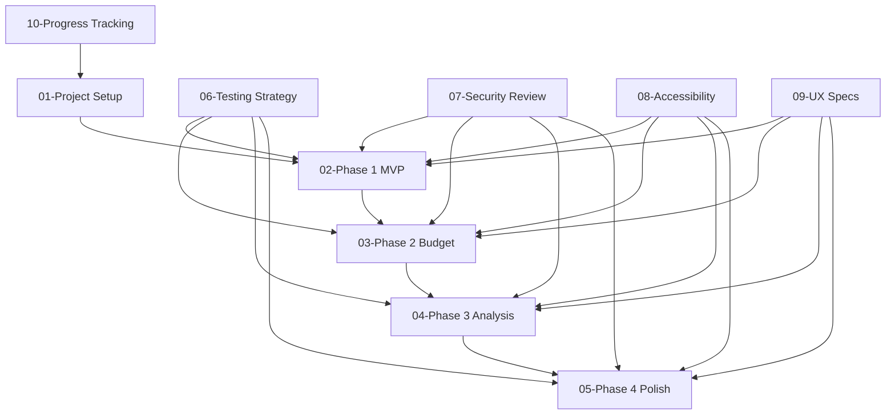

# HomeBuyerHelper Implementation Plan

This document provides a comprehensive implementation roadmap for the HomeBuyerHelper application—a privacy-first, offline-capable native app built with .NET MAUI that helps home buyers make data-driven decisions.

## Table of Contents

| # | Document | Description |
|---|----------|-------------|
| 1 | [Project Setup & Architecture](./01-project-setup.md) | Initial project structure, tooling, development environment, and architectural decisions |
| 2 | [Phase 1: MVP](./02-phase1-mvp.md) | Core property evaluation engine for iOS and Android |
| 3 | [Phase 2: Budget Planning + Desktop](./03-phase2-budget-desktop.md) | Financial planning module and Windows/macOS expansion |
| 4 | [Phase 3: Advanced Analysis + Sync](./04-phase3-advanced-analysis.md) | Commute analysis, funding calculator, and cloud sync |
| 5 | [Phase 4: Polish + Sharing](./05-phase4-polish-sharing.md) | Quality improvements, collaboration, and platform optimization |
| 6 | [Testing Strategy](./06-testing-strategy.md) | Testing approach, Definition of Done, and quality gates |
| 7 | [Security Review Guidelines](./07-security-review-guidelines.md) | Security review checklists and AI-assisted security analysis |
| 8 | [Accessibility Guidelines](./08-accessibility-guidelines.md) | WCAG compliance, platform-specific accessibility, and testing |
| 9 | [UX Specifications](./09-ux-specifications.md) | Detailed UX recommendations, wireframe guidance, and design system |
| 10 | [Progress Tracking](./10-progress-tracking.md) | Mechanisms for tracking implementation progress |

---

## Executive Summary

### Vision

HomeBuyerHelper empowers home buyers with systematic property evaluation, comprehensive budget planning, and intelligent funding strategy analysis—all while keeping their sensitive financial data completely private and offline.

### Core Principles

1. **Privacy-First**: No accounts, no tracking, no data leaves the device without explicit user action
2. **Offline-First**: Full functionality without internet—use it at open houses, in basements, anywhere
3. **Native Experience**: True native UI on each platform via .NET MAUI, not web wrappers
4. **Accessibility**: WCAG 2.1 AA compliance across all platforms from day one
5. **Quality-Driven**: Comprehensive testing with security reviews at every phase

### Technology Stack

| Component | Technology |
|-----------|------------|
| Framework | .NET MAUI (.NET 8 LTS) |
| Language | C# |
| Local Database | SQLite with sqlite-net-pcl |
| UI Toolkit | .NET MAUI + CommunityToolkit.Maui |
| MVVM Framework | CommunityToolkit.Mvvm |
| Charts | LiveCharts2 + SkiaSharp |
| PDF Export | QuestPDF |
| Testing | xUnit + NSubstitute + Playwright (UI) |

### Phase Overview

```
Phase 1 (MVP)              Phase 2 (Budget)           Phase 3 (Analysis)         Phase 4 (Polish)
├─ Property Evaluation     ├─ Budget Planning         ├─ Commute Analysis        ├─ Cross-platform Sync
├─ Guided Onboarding       ├─ Cash Flow Projection    ├─ Funding Calculator      ├─ Sharing Features
├─ iOS + Android           ├─ Windows + macOS         ├─ Tax Impact Analysis     ├─ Dark Mode
├─ SQLite Storage          ├─ PDF Reports             ├─ Optional Cloud Sync     ├─ Tablet Optimization
└─ App Store Submission    └─ Desktop Store Submit    └─ Photo Attachments       └─ Template Sharing
```

---

## Implementation Philosophy

### AI-Assisted Development

This implementation plan is designed for execution by Claude Code or similar AI coding assistants. Each task includes:

- **Clear acceptance criteria** that can be verified programmatically
- **Test requirements** specified alongside implementation
- **File paths and code patterns** to guide implementation
- **Security considerations** to check during code review

### Progress Tracking

Every major task includes:

- **Task ID**: Unique identifier for tracking (e.g., `P1-T001`)
- **Status markers**: `[ ]` Not started, `[~]` In progress, `[x]` Complete
- **Dependencies**: Clear indication of what must be done first
- **Verification steps**: How to confirm the task is complete

### Quality Gates

Each phase ends with mandatory quality gates:

1. **All tests passing** (unit, integration, UI)
2. **Security review completed** (using AI security analysis)
3. **Accessibility audit passed** (automated + manual)
4. **Performance benchmarks met** (startup time, memory usage)
5. **Documentation updated** (inline and user-facing)

---

## Quick Start for Implementers

### Prerequisites

```bash
# Install .NET 8 SDK
# https://dotnet.microsoft.com/download/dotnet/8.0

# Install MAUI workload
dotnet workload install maui

# Verify installation
dotnet --list-sdks
dotnet workload list
```

### Starting Implementation

1. Begin with [01-project-setup.md](./01-project-setup.md) to establish the solution structure
2. Follow tasks in order within each phase document
3. Complete the [Testing Strategy](./06-testing-strategy.md) tasks alongside feature implementation
4. Run security reviews at phase completion per [Security Review Guidelines](./07-security-review-guidelines.md)
5. Validate accessibility per [Accessibility Guidelines](./08-accessibility-guidelines.md) before phase sign-off
6. Update [Progress Tracking](./10-progress-tracking.md) as work completes

### Definition of Done (Summary)

A task is complete when:

- [ ] Implementation matches acceptance criteria
- [ ] Unit tests written and passing (>80% coverage for new code)
- [ ] Integration tests added where applicable
- [ ] Accessibility attributes added to all UI elements
- [ ] No new compiler warnings introduced
- [ ] Code follows established patterns in codebase
- [ ] Security considerations documented/addressed

---

## Document Dependencies



---

## Related Documents

- [DesignSpec.md](../DesignSpec.md) - Full product design specification
- [README.md](../../README.md) - Project overview

---

## Version History

| Version | Date | Changes |
|---------|------|---------|
| 1.0 | 2026-01-06 | Initial implementation plan |
